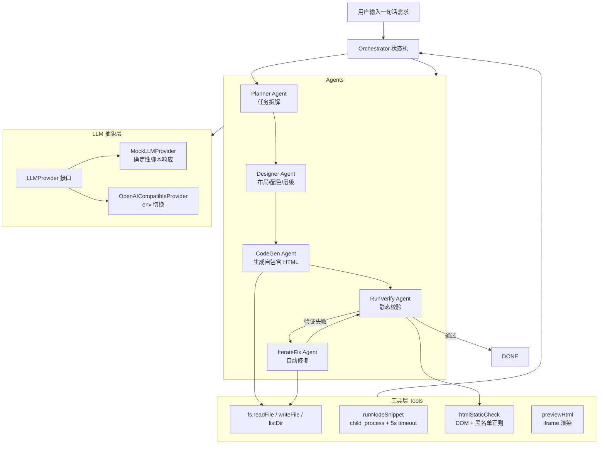

# Agent Design Lab · 多 Agent 智能设计系统 MVP

> 一句话简介：一个由 5 个专业化 Agent 协作、自动把"一句话需求"变成"可运行 HTML 信息图表页面"的多智能体编排系统，为同济大学 iDVX Lab「智能信息设计—Agent 系统研发实习生」岗位而构建。


---

## 1. 技术栈

| 层 | 技术 |
|---|---|
| 框架 | Next.js 14 (App Router) + React 18 |
| 语言 | TypeScript (strict) |
| 运行时 | Node.js 22+（API Routes 作为后端） |
| 样式 | Tailwind CSS |
| DOM 解析 | node-html-parser（轻量，零重型依赖） |
| 进程隔离 | node:child_process.execFile（带 5s 超时） |
| LLM | 内置 Mock（默认）/ OpenAI 兼容协议（可选） |

## 2. 系统架构



**状态机流转：** `PLAN → DESIGN → CODEGEN → VERIFY → [FIX ↔ VERIFY] × N → DONE / FAILED`

---

## 3. 快速开始

```bash
# 1. 安装依赖
npm install

# 2. 启动开发服务器
npm run dev

# 3. 打开浏览器
#    http://localhost:3000
#    在左侧输入框输入一句话需求，例如：
#    "做一个展示上海房价趋势的信息图表页面"
#    点击「启动多 Agent 协作」，右侧时间线会逐步展示 5 个 Agent 的工作过程，
#    底部 iframe 实时预览生成的 HTML 页面。
```

无需任何 API Key，开箱即用——默认走内置 Mock LLM。

---

## 4. 如何切换到真实 LLM

```bash
# 复制环境变量模板
cp .env.example .env.local

# 编辑 .env.local，填入：
OPENAI_API_KEY=sk-xxxxxxxx
OPENAI_BASE_URL=https://api.deepseek.com/v1   # 兼容 OpenAI 协议均可
OPENAI_MODEL=deepseek-chat
```

支持所有兼容 OpenAI `/chat/completions` 协议的服务：
- DeepSeek
- Moonshot Kimi
- OpenRouter
- 任意自建 vLLM / Ollama OpenAI 兼容端点

切换后 `npm run dev` 重启即生效。Orchestrator 启动时会自动检测 `OPENAI_API_KEY` 是否存在，存在则用真实 Provider，否则 fallback 到 Mock。

---

## 5. 设计决策说明

### 5.1 为什么把工具层放在 Next.js API Route？

- **安全边界**：`child_process`、`fs`、路径遍历防护都是 server-only 能力，绝对不能暴露到浏览器端。API Route 作为唯一入口，天然隔离了前端和危险操作。
- **部署简单**：Next.js 一个进程同时托管前端 UI 和后端工具调用，不需要单独起一个 Node 服务。
- **可替换**：后续要换成独立 Express / FastAPI 后端，只需要改 API Route 内部调用，工具层 `src/tools/` 本身可以原样搬过去。

### 5.2 为什么默认用 Mock LLM？

- **零配置演示**：面试官 clone 下来 `npm install && npm run dev` 立刻能看到完整流程，不需要申请任何 Key。
- **确定性输出**：Mock 返回写死的上海房价数据卡片 HTML，每次跑结果一致，方便截图、录屏、做 demo。
- **架构可插拔**：`LLMProvider` 接口只暴露一个 `complete()` 方法，真实实现和 Mock 实现对 Orchestrator 完全透明——这就是"面向接口编程"的演示。

### 5.3 Context 截断策略

每个 Agent 维护自己的 `ContextManager`（消息历史）。当历史字符总数超过阈值（默认 8000 字符，约 2000 token）时：

1. **保留 system prompt**（角色定义永远在）；
2. **保留最近 K 条消息**（默认 4 条，保证上下文连贯性）；
3. **中间插入摘要占位符**：`[context truncated: N earlier message(s) removed]`。

这是一个简化版的"滑动窗口 + 系统提示永久保留"策略，生产环境可以把摘要占位符换成 LLM 生成的真实摘要。

### 5.4 错误恢复策略

- **单步重试**：任一 Agent 的 LLM 调用或工具调用抛错，Orchestrator 会把错误信息包装成 user message 喂回该 Agent，重试一次（`maxRetries=1`）。
- **迭代上限**：Fix → Verify 循环最多跑 N 轮（默认 3，可配置），超过后标记 run 失败并把错误透传到前端。
- **不吞错**：所有错误都会记录在 `AgentStep.error` 字段里，前端时间线可见。

---

## 6. 可复用模块清单

以下模块与具体业务解耦，可以直接抽出来给其他 Agent 项目复用：

| 模块 | 路径 | 复用价值 |
|---|---|---|
| LLM 抽象层 | `src/llm/provider.ts`, `mock.ts`, `openai.ts`, `factory.ts` | 任何需要"可插拔 LLM 后端"的项目 |
| Tool schema 定义 | `src/tools/schemas.ts` | OpenAI function calling 标准格式，直接套用 |
| 工具调度器 | `src/tools/index.ts` | 按 name 路由到具体实现，扩展新工具只需加 case |
| 上下文截断器 | `src/context/manager.ts` | 任意多轮对话 Agent 都需要 |
| Orchestrator 状态机 | `src/orchestrator.ts` | 改一下状态转移图就能变成别的 pipeline |
| HTML 静态校验 | `src/tools/htmlStaticCheck.ts` | 任何"AI 生成 HTML 后自动审"的场景 |
| 子进程沙箱执行 | `src/tools/runNodeSnippet.ts` | 需要跑不可信用户代码又怕崩主进程的场景 |

---

## 7. 局限与 TODO

当前是 MVP，以下功能**尚未实现**（诚实声明）：

- ❌ 没有接真实浏览器自动化（Puppeteer / Playwright），iframe 预览只能做静态渲染，不能做交互截图回归。
- ❌ 没有接 Docker 容器化执行，`runNodeSnippet` 跑在宿主机子进程里，不是完全隔离的沙箱。
- ❌ 没有做并发——一次只跑一个 run，没有任务队列。
- ❌ 前端时间线是 run 完成后一次性返回，没有 SSE / WebSocket 实时流式推送步骤。
- ❌ Mock LLM 的 Function Calling 是"摆设"——schema 写好了，但 Mock 不会真的返回 tool_calls，真实 LLM 下才会走工具调用回路。
- ❌ 没有持久化——run 记录存在内存里，重启就丢。

---

## 8. 作者

**你的姓名 / Your Name**
联系邮箱：`your.email@example.com`

同济大学 iDVX Lab · 智能信息设计方向
